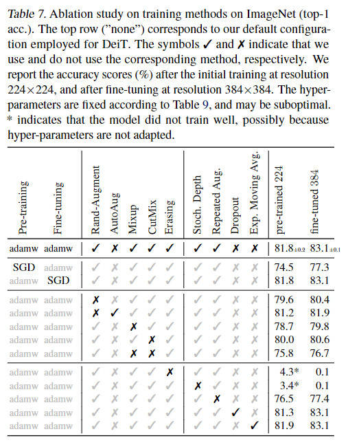

# [A survey on vision transformer](https://ieeexplore.ieee.org/stamp/stamp.jsp?arnumber=9716741)

- In most cases, ViT is pre-trained on large datasets, and then fine-tuned for downstream tasks with smaller data.

ViT yields modest results when trained on **mid-sized** datasets such as ImageNet, achieving accuracies of a few percentage points below ResNets of comparable size. Because transformers lack some inductive biases inherent to CNNs–such as translation equivariance and locality–they do not generalize well when __trained on insufficient amounts of data__. However, the authors found that training the models on large datasets (14 million to 300 million images) surpassed inductive bias. When pre-trained at sufficient scale, transformers achieve excellent results on tasks with fewer datapoints. For example, when pre-trained on the JFT-300M dataset, ViT approached or even exceeded state of the art performance on multiple image recognition benchmarks. Specifically, it reached an accuracy of 88.36% on ImageNet, and 77.16% on the VTAB suite of 19 tasks 

# [DeiT: Data-efficient image Transformers](https://arxiv.org/abs/2012.12877)

__knowledge distillation__: 指用把一个大模型的知识传递给一个小模型的过程, 达到蒸馏模型的目的.

patch embedding 可以保留 full dimension (3x16x16 $rightarrow$ 768)

__Fixing the positional encoding across resolutions__: 先在 low resolution 上训练, 然后转向 high resolution. 唯一要改变的是 positional encoding.

__ViT-B / DeiT-B__ parameter: `embed_dim` = 768, `num_heads` = 12, `n_layers` = 12

对于更小的模型, 保持每个头的维度不变为64

Transformer 在运算速度上比 CNN 慢

ablations:

- SGD 很不好; 不需要 dropout
- Transformers are __sensitive__ to initialization: 

# [How to start training: the effect of initialization and architecture](https://arxiv.org/abs/2106.11286)

首先定义两种现象:

__FM1__: 随着层数增加, 最后一层的输出大小指数增长/减小

__FM2__: 随着层数增加, 最后一层的输出的方差指数增长/减小

- 深入研究了各种网络结构的训练中, 两种现象和 initialization, architecture 的关系. 更加着重于后者.

- 对于 fc / conv 层, FM1 主要和初始化, FM2 主要和模型架构有关. 而对于 __residual structure__, 只要没有 FM1, 就不会有 FM2.

- 对于 resnet 的 FM1 现象, 考虑加入 __scale__ (x $\leftarrow$ x + scale * F(x)); scale=1 会发散, 一般把 scale 设成几何衰减 (发散与否和 scale 的求和有关).

